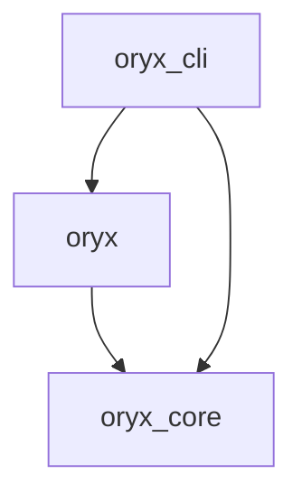

# Namespace packages in Python

Figure out how to have multiple Python packages depending on each other like below,
with "native" `pyproject.toml` files and an easy development experience.

https://stackoverflow.com/a/76616926/

https://packaging.python.org/en/latest/guides/packaging-namespace-packages/

https://peps.python.org/pep-0508/

https://stackoverflow.com/q/75159453/

https://github.com/pypa/pip/issues/6658
