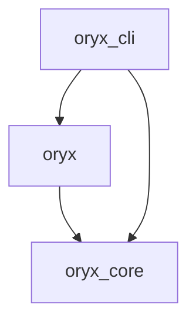

# Namespace packages in Python

Figure out how to have multiple Python packages depending on each other like below,
with "native" `pyproject.toml` files and an easy development experience.



## Setup

Simply run

```bash
pip install -e oryx-cli

# Simpler
pip install -e ./oryx/

# Works???
pip install -e oryx-core/ oryx/

pip install -e oryx-core -e oryx -e oryx-cli
```

## Links

https://stackoverflow.com/a/76616926/

https://packaging.python.org/en/latest/guides/packaging-namespace-packages/

https://peps.python.org/pep-0508/

https://stackoverflow.com/q/75159453/

https://github.com/pypa/pip/issues/6658

https://github.com/pdm-project/pdm/discussions/600

https://setuptools.pypa.io/en/latest/userguide/package_discovery.html

https://github.com/dkmiller/modern-python-package/
