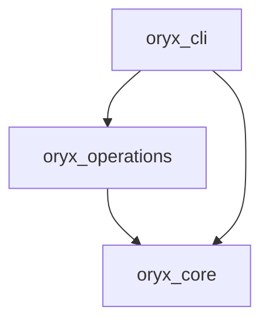

# Namespace packages in Python

Figure out how to have multiple Python packages depending on each other like below,
with "native" `pyproject.toml` files and an easy development experience.



Criteria for this "steel thread":

1. Single, simple command for pip installing an editible copy of all packages for local development.
2. Development should work out of the box with native Python tech (`pip`, `build`, `setuptools`);
  requiring latest versions is fine.
3. Delightful VS Code experience (intellisense) out of the box.
4. No need to set custom environment variables.
5. Unit testing works easily.

## Setup

Simply run

```bash
pip install -r requirements.txt
```

## Links

https://stackoverflow.com/a/76616926/

https://packaging.python.org/en/latest/guides/packaging-namespace-packages/

https://peps.python.org/pep-0508/

https://stackoverflow.com/q/75159453/

https://github.com/pypa/pip/issues/6658

https://github.com/pdm-project/pdm/discussions/600

https://setuptools.pypa.io/en/latest/userguide/package_discovery.html

https://github.com/dkmiller/modern-python-package/

https://stackoverflow.com/a/76214384/

- VS Code approach is better than `editable_mode=strict` approach; no simple way to do multiple
  of the latter in single `requirements.txt` file, though this works:
  ```bash
  pip install -e oryx-core -e oryx-operations -e oryx-cli --config-settings editable_mode=strict
  ```
- https://github.com/pypa/setuptools/issues/3557
- https://github.com/microsoft/pylance-release/issues/3473
- https://github.com/microsoft/pyright/issues/1473

https://setuptools.pypa.io/en/latest/userguide/development_mode.html
