# Python unit testing SSH

Unit-testing functionality that involves SSH is hard. Attempt to see what we can do with
[Paramiko](https://docs.paramiko.org/en/latest/api/server.html)
and
[`sample_ssh_server.py`](https://gist.github.com/cschwede/3e2c025408ab4af531651098331cce45)

TODO:

- https://www.fabfile.org/
- https://hub.docker.com/r/linuxserver/openssh-server


[`expected OPENSSH key` means user is unknown](https://github.com/paramiko/paramiko/issues/1612)

## Crawl walk run

- Native Python for RSA private/public key generation
- Native client &rarr; native server
    - Use this to validate the generated keys (used throughout the rest)
    - Hacky bash scripts, but gives a sense for what needs to be configurable
- Python-wrapped native client &mapsto; native server
    - Missing right now, this is e.g. `os.system("ssh ...")`
- Python client &mapsto; native server
    - This is the skipped `test_ssh` test.
- Python client &rarr; Python-wrapped native server
- Native client &rarr; Python server
    - Stuck here
- Python-wrapped native client &mapsto; Python server
- Python client &mapsto; Python server
    - North star!

In the diagram below, :smiling_imp: denotes "cannot easily unit test". It demonstrates that the
easiest course of development is to start with:

- Native &rarr; native, just to ensure things are working
- Python-wrapped &rarr; native
- Native &rarr; Python-wrapped

Once robust Python-wrapped clients and servers _both_ exist, you can make incremental changes to
the bottom of the graph without any need for non-unit testing. The current test
`test_ssh_with_dockerized_server` is _Python_ client &mapsto; wrapped server

```mermaid
flowchart TD
    python_keygen[RSA private/public key generation]
    native_native[😈 Native client &rarr; Native server]
    python_keygen --> native_native
    python_wrap_native[😈 Python-wrapped native client &rarr; native server]
    native_native --> python_wrap_native
    native_python_wrap[😈 Native client &rarr; Python-wrapped server]
    native_native --> native_python_wrap
    python_native[😈 Python client &rarr; Native server]
    python_wrap_native --> python_native
    python_wrap_python_wrap[Python-wrapped client &rarr; Python-wrapped server]
    python_wrap_native --> python_wrap_python_wrap
    native_python_wrap --> python_wrap_python_wrap
    python_python_wrap[Python client &rarr; Python-wrapped server]
    python_wrap_python_wrap --> python_python_wrap
    python_native --> python_python_wrap
    python_python[Python client &rarr; Python server]
    python_python_wrap --> python_python
    native_python[😈 Native client &rarr; Python server]
    native_python_wrap --> native_python
    python_wrap_python[Python-wrapped client &rarr; Python server]
    native_python --> python_wrap_python
    python_wrap_python_wrap --> python_wrap_python
    python_wrap_python --> python_python
```



Here is a simplified version of the same chart:

```mermaid
flowchart TD
    python_keygen[RSA private/public key generation]
    native_native[😈 Native &rarr; Native]
    python_keygen --> native_native
    wrapped_native[😈 Wrapped &rarr; native]
    native_native --> wrapped_native
    native_wrapped[😈 Native &rarr; Wrapped]
    native_native --> native_wrapped
    python_native[😈 Python &rarr; Native]
    wrapped_native --> python_native
    wrapped_wrapped[Wrapped &rarr; Wrapped]
    wrapped_native --> wrapped_wrapped
    native_wrapped --> wrapped_wrapped
    python_wrapped[Python &rarr; Wrapped]
    wrapped_wrapped --> python_wrapped
    python_native --> python_wrapped
    python_python[Python &rarr; Python]
    python_wrapped --> python_python
    native_python[😈 Native &rarr; Python]
    native_wrapped --> native_python
    wrapped_python[Wrapped &rarr; Python]
    native_python --> wrapped_python
    wrapped_wrapped --> wrapped_python
    wrapped_python --> python_python
```



----

## Misc

https://stackoverflow.com/a/34659332/

```bash
lsof -i :12343
```

## Debugging

In warp terminal:

```bash
./docker_v2.sh
```

In MacBook (i.e., separate) terminal:

```bash
python debug.py
```

In MacBook, _third_ terminal:

```bash
curl -v http://localhost:63752/foo
```

## Lessons

- Multiprocessing and async don't help. Plain old `Popen` and context managers are better.
- Don't try to parallelize "remote server" and "HTTP client" from the SSH client side. Use `screen`
  or something similar to let the long-running remote HTTP server run independently.

```python


# TODO: clean this up. It is no longer used.
def client_server_pairs(func):
    """
    Python does not support "parameterized fixtures", and in addition testing SSH client/server
    interaction is challenging.

    This specialized decorator uses a combination of parameterization, existing fixtures, and
    type hacking to inject `client:SshClient` and `server:SshServer`

    TODO: find a way to abstract away the boilerplate client/server construction by modifying the
    wrapped function's signature:

    - https://stackoverflow.com/a/64447219/
    - https://docs.python.org/3/library/functools.html
    """

    # TODO: why? You can't have "parameterized fixtures".

    original_sig: inspect.Signature = inspect.signature(func)

    scrubbed_parameters = [
        p
        for p in original_sig.parameters.values()
        if p.name not in ["client", "server"]
    ]

    injected_params = ["key_pair", "ports", "host", "client_type", "server_type"]

    for name in injected_params:
        if name not in original_sig.parameters:
            scrubbed_parameters += [
                inspect.Parameter(name=name, kind=inspect.Parameter.KEYWORD_ONLY)
            ]

    sig = original_sig.replace(
        parameters=scrubbed_parameters
        # + [
        #     inspect.Parameter(name="key_pair", kind=inspect.Parameter.KEYWORD_ONLY),
        #     inspect.Parameter(name="ports", kind=inspect.Parameter.KEYWORD_ONLY),
        #     inspect.Parameter(name="host", kind=inspect.Parameter.KEYWORD_ONLY),
        #     inspect.Parameter(name="client_type", kind=inspect.Parameter.KEYWORD_ONLY),
        #     inspect.Parameter(name="server_type", kind=inspect.Parameter.KEYWORD_ONLY),
        # ]
    )

    # raise Exception(inspect.signature(func))
    # Cartesian product via parametrize: https://stackoverflow.com/q/22171681/
    @pytest.mark.parametrize("client_type", [FabricClient, SshCliWrapper])
    @pytest.mark.parametrize("server_type", [OpensshDockerWrapper])
    @pytest.mark.timeout(10)
    @wraps(func)
    # pytest uses signature(*) to determine function signature:
    # - https://stackoverflow.com/q/51125966/2543689
    # - https://github.com/pytest-dev/pytest/blob/ef1b91ba8721e85430eead4c2849d8e072fe8350/src/_pytest/python.py#L893
    # - https://github.com/pytest-dev/pytest/blob/ef1b91ba8721e85430eead4c2849d8e072fe8350/src/_pytest/compat.py#L147
    def wrapper(*args, **kwargs):
        # key_pair, ports, host, client_type, server_type,
        server = kwargs["server_type"].construct(
            kwargs["host"],
            kwargs["key_pair"].public.read_text(),
            [kwargs["ports"].remote],
        )
        client = kwargs["client_type"](kwargs["key_pair"].private, kwargs["host"])

        # with server.construct(host, key_pair.public.read_text(), [ports.remote]).serve():
        #     ssh = client(key_pair.private, host)

        # raise Exception(f"{injected_params} {list(original_sig.parameters.keys())}")

        for name in injected_params:
            if name not in original_sig.parameters:
                del kwargs[name]

        with server.serve():
            return func(*args, client=client, **kwargs)

    wrapper.__signature__ = sig

    # Change function signature: https://stackoverflow.com/a/33112180/

    # https://codereview.stackexchange.com/a/272072

    return wrapper
```
