# Python unit testing SSH

Unit-testing functionality that involves SSH is hard. Attempt to see what we can do with
[Paramiko](https://docs.paramiko.org/en/latest/api/server.html)
and
[`sample_ssh_server.py`](https://gist.github.com/cschwede/3e2c025408ab4af531651098331cce45)

TODO:

- https://www.fabfile.org/
- https://hub.docker.com/r/linuxserver/openssh-server


[`expected OPENSSH key` means user is unknown](https://github.com/paramiko/paramiko/issues/1612)

## Crawl walk run

- Native Python for RSA private/public key generation
- Native client &rarr; native server
    - Use this to validate the generated keys (used throughout the rest)
    - Hacky bash scripts, but gives a sense for what needs to be configurable
- Python-wrapped native client &mapsto; native server
    - Missing right now, this is e.g. `os.system("ssh ...")`
- Python client &mapsto; native server
    - This is the skipped `test_ssh` test.
- Python client &rarr; Python-wrapped native server
- Native client &rarr; Python server
    - Stuck here
- Python-wrapped native client &mapsto; Python server
- Python client &mapsto; Python server
    - North star!

In the diagram below, :smiling_imp: denotes "cannot easily unit test". It demonstrates that the
easiest course of development is to start with:

- Native &rarr; native, just to ensure things are working
- Python-wrapped &rarr; native
- Native &rarr; Python-wrapped

Once robust Python-wrapped clients and servers _both_ exist, you can make incremental changes to
the bottom of the graph without any need for non-unit testing. The current test
`test_ssh_with_dockerized_server` is _Python_ client &mapsto; wrapped server

```mermaid
flowchart TD
    python_keygen[RSA private/public key generation]
    native_native[😈 Native client &rarr; Native server]
    python_keygen --> native_native
    python_wrap_native[😈 Python-wrapped native client &rarr; native server]
    native_native --> python_wrap_native
    native_python_wrap[😈 Native client &rarr; Python-wrapped server]
    native_native --> native_python_wrap
    python_native[😈 Python client &rarr; Native server]
    python_wrap_native --> python_native
    python_wrap_python_wrap[Python-wrapped client &rarr; Python-wrapped server]
    python_wrap_native --> python_wrap_python_wrap
    native_python_wrap --> python_wrap_python_wrap
    python_python_wrap[Python client &rarr; Python-wrapped server]
    python_wrap_python_wrap --> python_python_wrap
    python_native --> python_python_wrap
    python_python[Python client &rarr; Python server]
    python_python_wrap --> python_python
    native_python[😈 Native client &rarr; Python server]
    native_python_wrap --> native_python
    python_wrap_python[Python-wrapped client &rarr; Python server]
    native_python --> python_wrap_python
    python_wrap_python_wrap --> python_wrap_python
    python_wrap_python --> python_python
```



Here is a simplified version of the same chart:

```mermaid
flowchart TD
    python_keygen[RSA private/public key generation]
    native_native[😈 Native &rarr; Native]
    python_keygen --> native_native
    wrapped_native[😈 Wrapped &rarr; native]
    native_native --> wrapped_native
    native_wrapped[😈 Native &rarr; Wrapped]
    native_native --> native_wrapped
    python_native[😈 Python &rarr; Native]
    wrapped_native --> python_native
    wrapped_wrapped[Wrapped &rarr; Wrapped]
    wrapped_native --> wrapped_wrapped
    native_wrapped --> wrapped_wrapped
    python_wrapped[Python &rarr; Wrapped]
    wrapped_wrapped --> python_wrapped
    python_native --> python_wrapped
    python_python[Python &rarr; Python]
    python_wrapped --> python_python
    native_python[😈 Native &rarr; Python]
    native_wrapped --> native_python
    wrapped_python[Wrapped &rarr; Python]
    native_python --> wrapped_python
    wrapped_wrapped --> wrapped_python
    wrapped_python --> python_python
```



----

## Misc

https://stackoverflow.com/a/34659332/

```bash
lsof -i :12343
```

## Debugging

In warp terminal:

```bash
./docker_v2.sh
```

In MacBook (i.e., separate) terminal:

```bash
python debug.py
```

In MacBook, _third_ terminal:

```bash
curl -v http://localhost:63752/foo
```
